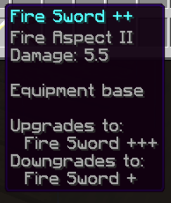
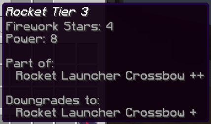
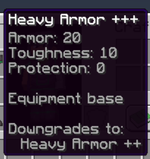
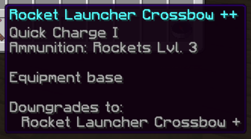

## General
The equipment system differentiates between 3 main categories: Melee, Ranged and Armor.

Each player starts with only a default melee weapon. Players can then upgrade and specialize their equipment using the equipment shops.

## Upgrading
Equipment can be upgraded at the equipment shops.
In most cases, they are located in the castle, the attacker spawn and the villages.
Upgrading works like this:
- At the beginning, you can choose one of multiple weapons/armors in each category.
- If you have chosen a specifig weapon/armor, you can upgrade it, which increases the stats of this weapon/armor.
- At certain levels you have to specialize the equipment instead of simply upgrading it. This works in a similar way to deciding on a weapon/armor previously.

## Downgrading
#### Involuntary
- If you die, your current equipment will fall back to the previous equipment level.
- However, there are safe levels from which you will not be downgraded further if you die.
- If you got killed by a enemy who has better equipment than you, you will not be downgraded directly. In this case, you will be downgraded the `otherEquipmentLevel - yourEquipmentLevel`-th time you die from this player.
#### Voluntary
- You cannot switch the weapons/armors or their specializations once you have selected them.
- If you are really sure that you have chosen the wrong equipment, you can buy an equipment reset at the equipment shop. This will reset the selected equipment category to the default level. then you can re-choose your weapon/armor again.

## Get Equipment Info
You can always hover over the item with your mouse to get detailed information about it.
This section shows you what the values mean.

#### Equipment Category
- **Upgrades to:** Shows the next possible equipment levels you can upgrade your equipment to. If not shown, you have already reached the maximum level in this category.
- **Downgrades to:** Shows the equipment level your equipment downgrades to when you die. If not shown, you are on a safe level.
- **Equipment base / Part of:** Some Items come with other items you need to use them. They are then "part of" another item. "Equipment base" means that the item is not part of any item. For example, the Rocket Launcher Crossbow is the base of the Rocket Tier 3.

#### Weapon/Armor Stats
- **Damage:** Attack Damage
- **Speed:** Attack Speed which is responsible for the attack Cooldown (if not shown: default)
- **Armor:** Armor points
- **Toughness:** Armor toughness
- **Protection:** Level of the protection enchantment
- **Other enchantments:** Shown like in vanilla

#### Examples

## Categories
Here you can see the upgrade maps of the categories.
The dashed line shows the safe levels.
#### Melee

#### Ranged

#### Armor

## Developer Info
#### Management command
The player equipment can be managed using the `/cc2 game players value` command.
##### Usage
`/cc2 game players value <player: (UUID|String)> equipment [<category: String> [<id: Integer>]]`

##### Examples
- Get all equipments: `/cc2 game players value <player> equipment`
- Get a specific equipment: `/cc2 game players value <player> equipment <category>`
- Set a specific equipment: `/cc2 game players value <player> equipment <category> <id>`

#### Responsibilities
The `ConquestEquipmentSystem` handles the equipment. `ConquestEquipmentData` stores information about one equipment level and contains `ConquestEquipmentItem`s that represents the items of that equipment. The `ConquestEquipmentSystem` uses the `EquipmentSystem` (game) as a base.
The `ConquestEquipmentGUI` is responsible for the equipment shop.
