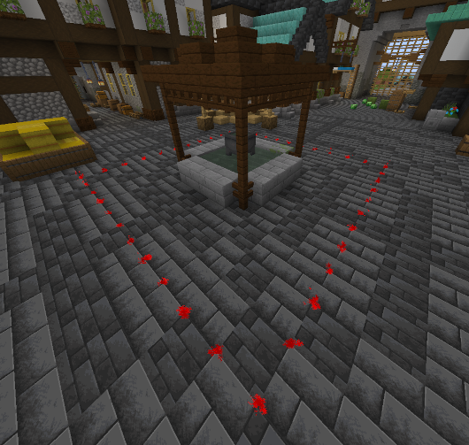
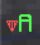

## General
Holding flags is the main objective in conquest mode.

For the attackers to win, they must hold more than half of all flags for 5 minutes.

In order for the defenders to win, the attackers must run out of their available time of 30 minutes.

Both timers are mutually exclusive. This means that if the attackers' 5-minute timer is active, the defenders' 30-minute timer is inactive.
The same applies the other way round, but the attackers' 5-minute timer counts up to 5 minutes again in the background as long as it is inactive.

## Behavior
| Status | Condition | Result |
|--|--|--|
| IDLE | No enemy team and no capturing progress on the flag | Nothing happens |
| Capturing | Other team is in the majority on the flag | Capturing progress inceases |
| Uncapturing | Holding team is in the majority on the flag | Capturing progress decreases |
| IDLE with progress | No team is on the flag, but there is still capturing progress on it | Capturing progress decreases slowly |
| Tie | Both holding team and other team is on the flag with the same amount of players | Nothing happens |

- When the capturing progress reaches 100 %, the team that had capturing progress on the flag is now the new holding team
- “Team in majority” means that the team has the most players on the flag compared to the other team.

## Appearance in world
#### Particles
The green or red particles on the ground are marking a flag area.
The particle color is the current holding team of the flag.
That means, if the flag is currently controlled by the defenders, the particles are green. When the attackers are holding the flag, the particles are red.

Here you can see how that looks:

#### Flag Object
A planned feature is that there is an actual flag model in the flag area.
Since we currently don't have someone who creates custom models, this feature isn't currently available.

## Sidebar
The sidebar shows the flags available.
The color of the flag letter is the current holding team.

There is also a capturing indicator.
It is shown in the color of the team which currently has capturing progress on the flag.
| Icon | State | In this example |
|--|--|--|
|  | Capturing | Attackers are capturing A. Capturing progress of attackers increases. |
|  | Uncapturing | Defenders are uncapturing A. Capturing progress of attackers decreases. |
|  | IDLE with progress | Attackers are not actively capturing A, but still have progress on it. Capturing progress of attackers decreases slowly. |
| N/A | IDLE or Tie | Defenders hold A without any capturing progress by the attackers, or both attackers and defenders have the same amount of players on the flag. |

## Flag Locations
#### Default map
| Letter | Location |
|--|--|
| A | In front of the main gate |
| B | Center of the Yard |
| C | Tower in the Throne Building of the Yard |
| D | Park (inofficially known as "Oxygen") in the basement |
| E | Dining room in the basement |
| F | Water Generator Room in the basement |

## Developer info
### Control command
#### Usage
`/cc2 game flags [<flagId: int> [area|captureprogressdecreaseidle|captureprogressdecreaseuncapture|captureprogressincreasecapture|captureprogressincreaseidle|capturingprogress|capturingteam [reset]|holdingteam [<holdingTeam: int>|id|location|majorityteam|name]]`
#### Examples
- Get list of flags: `/cc2 game flags`
- Show info about one flag: `/cc2 game flags <flagId>`
- Show specific info about one flag: `/cc2 game flags <flagId> captureprogressdecreaseidle`
- Change holding team: `/cc2 game flags <flagId> holdingteam 1`
- Reset capturing team (and progress): `/cc2 game flags <flagId> capturingteam reset`

### Flag states
#### How it works internally
Instead of the flag states which are shown to the outside, the flag uses 3 different values which then results in the flag state:

- `holdingTeam`: The team that is currently holding the flag
- `capturingTeam`: The team that has currently capturing progress on the flag
- `majorityTeam`: The team that has currently the majority of players on the flag

Then there is also the `capturingProgress`:
- Depending on the values, the `capturingProgress` increases, decreases or remains unchanged. If the `capturingProgress` reaches a certain value, the `capturingTeam` becomes the new holdingTeam.
- The `capturingProgress` resets to `0` if there is no `capturingTeam`.
- If the `capturingProgress` is `0` or below, the `capturingTeam` is cleared
- The `holdingTeam` cannot be the `capturingTeam`

#### Internal values to flag state
| Internal name | Condition | Result | Shown name |
|--|--|--|--|
| IDLE | `capturingTeam` not set | Nothing happens | IDLE |
| CAPTURING | `capturingTeam` is set and `capturingTeam == majorityTeam` | `capturingProgress` increases | Capturing |
| UNCAPTURING_BY_OWNER | `capturingTeam` is set and `majorityTeam == holdingTeam` | `capturingProgress` decreases | Uncapturing |
| UNCAPTURING_BY_OTHER | `capturingTeam` is set and `majorityTeam != holdingTeam != capturingTeam` | `capturingProgress` decreases | N/A (not possible except when using commands) |
| UNCAPTURING_IDLE | `capturingTeam` is set and `majorityTeam` not set | `capturingProgress` decreases | IDLE with progress |
| MULTIPLE_TEAMS | `capturingTeam` is set and majority team set to multiple teams value (-1) | Nothing happens | Tie |

### Responsibilities
- Each flag is represented by an object of `ConquestFlag`. They are stored in the flags map in `ConquestGame`.
- A `ConquestFlagCapturedEvent`is fired when the holding team of the flag changes (due to capturing).
  Cancelling this event will prevent the holding team from getting changed, but since it does not change anything else, the flag will try to change its holding team again the next tick if the conditions are the same.
- A `ConquestFlagPlayerOnFlagEvent` is fired for each player inside the flag area.
  Cancelling this event will remove the player from the majority team calculation for the current tick.
