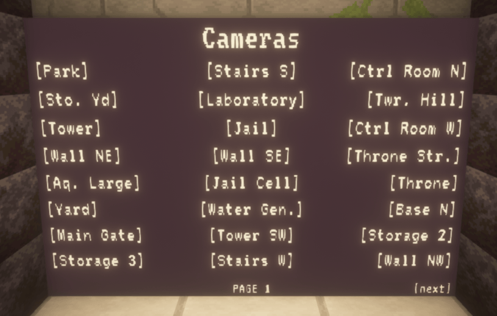
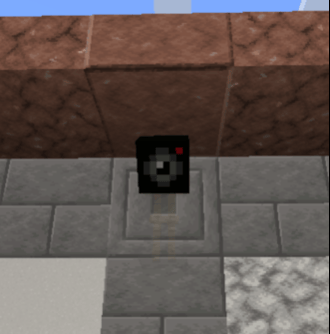

## General
Cameras are there to observe opposing players.

## How to use
Go to the camera screen and click on a camera.

While you are in the camera, you can make your observations.

To exit the camera, press SHIFT.

## Why there are no cameras?
Depending on the map and game mode, some or all cameras are not available from the start, but must first be unlocked by upgrading.

If no cameras are available, the camera screen will display “No cameras found”.

## Destruction and repair

#### Destroy
Enemies can destroy cameras by hitting the camera with a melee weapon or shooting it with a bow. The camera then explodes and can no longer be used. Players who are currently using the camera will be kicked out of it.

#### Repair
Cameras can be repaired by the castle crew using a replacement camera. These can - depending on the map and gamemode - be bought (in conquest, the Tool Seller sells them).

Right-clicking with the repalcement camera onto the broken camera will repair the camera.

For some cameras, you might need to get creative ideas how to access them.

A working camera looks like this:

## Removing players from cameras

To get a player out of a camera, push that player that's standing in front of the camera.
The player will then leave the camera and you can kill them if you want to.

Please note that you can't see some armor parts of that player while they is using the camera.

## Developer Info

#### Control command
##### Usage
`/cc2 map value cameras [camera id] [property] [value]`

##### Examples
- List cameras: `/cc2 map value cameras`
- Get camera properties: `/cc2 map value cameras <camera id>`
- Get/Set camera property `/cc2 map value cameras <camera id> <property> [value]`

#### Responsibilities
Camera objects (`CastleCamera`) are stored in the `cameras` map inside the `CastleMap`.

The player standing in front of the camera while the player is inside the camera is handled by `PlayerDummy`.

The camera monitor is handled by `CameraScreen` which is a `ValueUpdatingSynchronizedScreen`.

A `CameraPlayerAddEvent` is fired when a player enters the camera. A `CameraPlayerRemoveEvent` is fired when the player leaves the camera. The first one can be cancelled to regulate which player can join the camera and which not.

A `CameraBreakEvent` is fired when a camera gets destroyed. A `CameraRepairEvent` is fired when a camera gets repaired. Both events contains the players that have performed this action and are cancellable to regulate which players can destroy/repair cameras.
