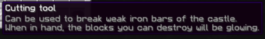
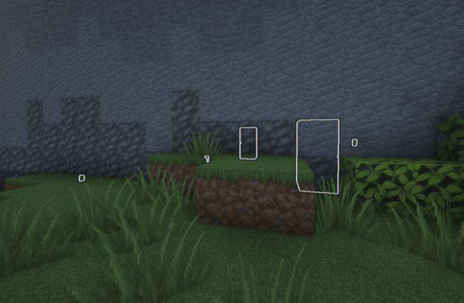

## General
Map destruction provides a way for attackers to get into the castle.
It is also used to access special areas on the map.

Players can't just destroy every block in the world. There are special blocks (for example in the castle wall) players can destroy with the right tool.

Destroyed blocks can be repaired, also using a special item.

## Break blocks
1. Get the tool for the block you want to break.
You will most likely use a "Wall Breaker" to destroy blocks in the castle wall or a "Cutting Tool" to destroy iron bars (aqueducts). 

3. Take the right tool in your hand.
You will now see all blocks you can destroy with the tool glowing. 

5. Break the block you want to break.

## Repair blocks
1. Get a repair tool.
You will most likely use a "Wall Repair Kit" for plugging holes inside the castle wall.

2. Right-click with the repair tool onto the broken block.

3. Wait until the timer has finished. After the timer has finished, the block is repaired.
When the timer is running, the repair kit can be removed by right-clicking on it. This can be used by attackers to prevent the wall repair.

## Useful information
- The status monitor of the default map can detect if the castle is damaged.
It shows a warning message at the bottom and shows a red marker at the side where the damage is.

## Developer information
There is currently no command which allows managing damageable blocks.

Destroyable/repairable blocks are currently handled by `CastleRepairManager`. It manages `DestroyableCastleBlock` objects. Both of them are using the `BlockModificationManager` and `BlockModificationZone`s to add exceptions to allow map destruction at this location.
