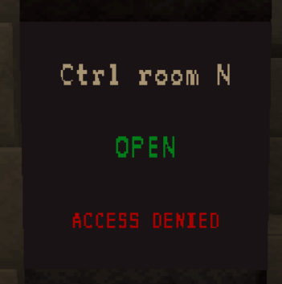
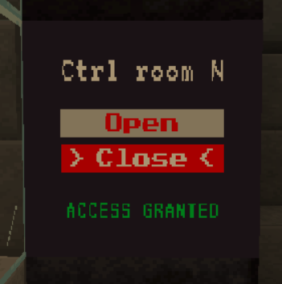

# General
Doors are used in the castle to deny unauthorized persons access to certain areas. However, there are also a few doors for purely decorative reasons.

# States
Doors can either be **open**, **closed** or **destroyed**. A destroyed door is like an open door, except that it can no longer be controlled. Destroyed doors can be repaired.

A door can also be **locked** or **unlocked**. If a door is locked, it can no longer be controlled by certain means, such as the keycard reader.

# Controlling doors
## Keycard Reader
There is a keycard reader next to most doors. If you have the correct keycard in your inventory, “Access Granted” appears on the display and the door can be opened/closed by clicking on the corresponding button.

If “[!] Locked” appears on the screen, the door is locked and can no longer be controlled by the keycard reader (see door control screen).

On the default map, keycard readers requires power level 1 in order to work.

## Door control monitor
The door control screen can be used to centrally manage all doors in the castle.

The door control screen has different functions depending on the level:
1. display door status
2. display door status, open/close doors
3. display door status, open/close doors, lock/unlock doors

The door control screen can be upgraded in some game modes to unlock a higher level.
In other game modes, the door control screen is deactivated or set to a specific level that cannot be changed.

On the default map, the door control monitor requires power level 1 in order to work.

## Auto-opening
Some doors will just automatically open when a player is nearby and will close if the player is gone.

# Destroying doors
If you are locked in because the castle has no power or you just want a permanent entrane into the castle without restrictions, it's probably time to send a door to hell by bombing it into oblivion.

There are several ways to do it.

## Gate Cannon
If you want to destroy the gates of the castle, you can use the gate cannon for it.

The Gate Cannon must be placed in the designated position so that it can be set up.
Once it has been passed in the right place, it is automatically set up. Otherwise an error message will be displayed.

To fire the gate cannon, you need to find the "Fire"-Button. It is normally located on top or on the back side of the cannon. You then need to shoot at the gate until it breaks.

Please be aware that the cannon projectiles have an explosion size of 10. This will kill other players when they are near the door (you get kills from that btw).

To destroy the gate cannon, you can just break any block of it and it will disappear.

## C4 / Door Explosive Charges
You can blow up doors using C4.

To attach a charge of C4 to a door, right-click on the door with the C4 item.
The C4 charge is armed immediately after being placed and will explode after a few seconds.

However, this does not mean that the door will be destroyed. Most doors need more than just one charge of C4. So if only the one C4 explodes, it is useless and the charge of C4 has been wasted.
You should therefore always make sure that as much C4 as possible is attached to a door.

If C4 is attached to a door, it cannot be opened or closed.

C4 can be removed again by right-clicking on it. You will not get the item back.

# Repairing doors
## Door repair kit
Doors can be repaired using a door repair kit.
To use the Door Repair Kit, right-click in the frame of the destroyed door.
The door frame is filled with scaffoldings if the repair is in progress.
The current progress is displayed in the action bar.
A repair can be canceled during construction by hitting the scaffolding.
Once the repair is complete, the door appears and opens automatically.

# Developer Info

## Control command
Doors can be controlled by using the `/cc2 map value doors` command.

### Usage
`/cc2 map value doors [<doorId> [(state|location|animationtime|active [(true|false)]|(broken [true|false)]|(locked [true|false])|(name [<name>])|open|close|forceopen|forceclose|destroy|repair)]]`

### Examples
- List all: `/cc2 map value doors`
- Get info: `/cc2 map value doors control_room_north`
- Get specific info: `/cc2 map value doors control_room_north broken`
- Set info: `/cc2 map value doors control_room_north broken true`
- Actions: `/cc2 map value doors control_room_north open`

## Responsibilities
The door system is using the `DoorManager` inside `CastleMap` to handle `CustomDoor` objects which are representing each door.

The "door controlling systems" (like the keycard readers) are handled by `DoorAccessProviders`, which are stored in the `DoorAccessContainer` which is inside `CastleMap`. `DoorAccessProviders` can be replaced (e.g. by upgrade tasks inside the specific map implementations) to change door behavior.

The door control monitor (`DoorControlMonitor`) is doing it's own thing, without any relation to the `DoorAccessProvider`s.
