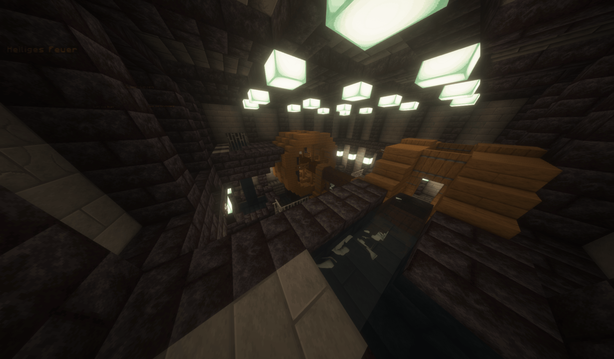

## General
There are many systems in the castle that require electricity. Some of them more than others.

The castle crew must ensure that the systems in the castle have a functioning power supply to ensure their functionality.

Attackers, on the other hand, can try to sabotage the power supply in order to disrupt the systems in the castle and weaken the castle crew.

This article only describes the standard power system. Other maps may use a different system.

## How the energy system works

### How it works
In the castle's energy system, there is no amount of electricity that is available and no direct consumption.

Instead, there is a power level that indicates how much energy is currently available to the castle.

Every energy source can influence the power level. Some energy sources raise it to a certain value, some increase it by a certain value. In addition, there are energy stores that are charged as long as other power sources are available and are discharged when the castle has too little power.

In the end, the global power level of the castle is calculated from all power sources. Certain systems then only work from a certain power level. If it is lower, those systems will not work or will have limited functionality.

### Types of power sources
#### Producers
Each energy producer provides a specific power level.

This power level can be made available in two different ways:
- **Hold:** Keeps the power level at a certain value. If there is already an energy source that provides a higher power level, the energy source has no influence.
- **Add Up:** The power level of all add-up power sources is added together. This added value then forms another hold power level.

#### Storages
Power storage systems store energy as long as they provide the same or a lower power level than other power sources.

However, if they provide a higher power level, they are discharged.

Depending on the energy storage device, the speed of charging and discharging depends on the distance between the power level produced and the power level provided by the energy storage device.

### Calculation of the power level
The power level is calculated using the following formulas:

$$\text{addUpPowerSourceLevel} = \sum_{i=1}^{n} P_{\text{source}, i}$$

$$\text{heldPowerSourceLevel} = \max_{k=1, \dots, m} (P_{\text{held}, k})$$

$$\text{providedPowerLevel} = \max(\text{addUpPowerSourceLevel}, \text{heldPowerSourceLevel})$$

$$\text{highestPowerStorageLevel} = \max_{k=1, \dots, o} (P_{\text{storage}, k})$$

$$\text{powerLevel} = \max(\text{providedPowerLevel}, \text{highestPowerStorageLevel})$$

If highestPowerStorageLevel is higher than providedPowerLevel, the power storage will discharge. If it is empty, it will return power level 0.

If highestPowerStorageLevel lower or equal than providedPowerLevel, the power storage will charge.

## Power control monitor
The power control monitor displays all power sources and the current power level. It can also be used to change some settings relating to the power supply.

From left to right and top to bottom:
- **Name:** The name of the power source
(in this picture it is "Small Aqueduct", "Large Aqueduct", "Battery" and "Generator")
- **Storage Type:** The type of the storage
	- `=`: Held power producer
  - `+`: Add up power producer
  - `S`: Power storage
- **Status indicator:** Displays the current status
	- On: Source enabled and producing power
  - Off: Source disabled or not producing power
  - FLL: Storage-specific status indicator which stands for "Full"
  - CHG: Storage-specific status indicator which stands for "Charging"
- **Provided power level:** The power level the energy source is currently providing ("-----" for nothing and "PWR x" for power level)

Storage-specific:
- **Charge Level**: The current charge level of the storage (in this picture 100 %)

Battery-specific (specific type of storage):
- **Power level selection:** Press "<" or ">" buttons to select the power level (in this picture "<0>, where 0 is the selected power level)
- **Autostart indicator:**: If "AS" is shown, the autostart feature is available for that battery 

Generator-specific:
- **Fuel indicator:** The time the fuel of the generator is burning (in this picture "FUEL 0s + 0s").
The first value is the fuel currently burning inside the generator.
The secon value is the fuel inside the generator's inventory.

## Power Producers
There are several energy sources to power the castle.

Some of these are internal, others external.

The most important ones are listed here, but other maps may also have other energy sources.

### Aqueducts
Aqueducts drive a water wheel that generates electricity. They are the main source of energy on the default map.

An important advantage of the aqueduct as an energy source is that the player does not have to do anything to maintain it as long as the aqueduct is not deactivated manually.
One disadvantage, however, is that it can be sabotaged from the outside. As the castle crew, you then have to leave the castle to switch it back on.

On the default map, the large aqueduct produces power level 2, the small one power level 1. If both are active, they produce power level 3 because they are “add up” power sources (see calculation).
The small aqueduct automatically fills with water during thunderstorms, even if the aqueduct is deactivated.

### Coal generator
The power generation furnace generates energy by burning all possible fuels that can be found on the map.

One advantage is that the items intended for combustion can be stored in the castle so that the castle crew does not have to leave the castle to maintain the power source.

A major disadvantage, however, is that you need enough fuel. If the castle runs out of fuel, the power supply fails and the castle crew must obtain new fuel from outside.

On the standard map, the generator raises the power level to 2. If there are power sources that produce a higher power level, the generator does not change anything (and should therefore be deactivated by the user).

There is also an Easter Egg that can be used to burn more than just items in the generator.

## Power Storages
### Battery
The batteries are an energy storage option that makes it possible to delay power failures somewhat and thus create a period of time in which the castle crew can restore the other power sources.

Batteries have a charge level, a capacity and a maximum power level that they can provide.

#### Charge level
The capacity indicates the maximum amount of energy the battery can store.

The charge level of the battery indicates how much energy the battery currently still has stored. If this drops to 0, the battery is empty and does not provide a power level. If the battery is charged, the charge level increases until the capacity is reached.

How exactly the charge level in the battery changes when it is charged/discharged differs depending on the battery.
The standard calculation is as follows:
- Charging: 
$chargeLevel = chargeLevel + (powerLevelDifference \cdot chargeMultiplier)$
- Discharging: 
$powerLevelDifference = highestPowerStoragePowerLevel - highestSourcePowerLevel$
$chargeLevel = chargeLevel - (powerLevelDifference \cdot dischargeMultiplier)$
Here, $providedPowerLevel$ is the power level provided by the current battery, and $highestSourcePowerLevel$ is the highest power level provided by power sources.

On the default map, $chargeMultiplier$ is currently $2$ and $dischargeMultiplier$ is currently 3.

#### Power level
The maximum power level indicates the maximum power level that the battery can provide.

The power level indicates how much power the battery is currently actually providing. This value can usually be set by the user and cannot exceed the maximum power level.

The higher the selected power level of the battery, the faster it discharges.

Setting the power level allows users to weigh up between the functionality of some systems and a longer runtime. The battery can also be used as a buffer if a higher power level is required for a short time than is currently available from power producers.

#### Autostart
If the user has deactivated the battery and the power fails in the entire castle, the user can no longer activate the battery via the control screens, as these will also fail.

The autostart feature solves this problem by automatically activating the battery as soon as the power in the castle fails.

This feature is not available for all batteries.

## Developer Info

### Control Command
#### Usage
`/cc2 map powermonitor [(override [value]|powerlevel|sources [source id] [property] [value])]`

#### Examples
- Show general status: `/cc2 map powermonitor`
- Override power level: `/cc2 map powermonitor override <power level>` (set override to -1 to disable)
- Show power level: `/cc2 map powermonitor powerlevel`
- Get power sources: `/cc2 map powermonitor sources`
- Get power source properties: `/cc2 map powermonitor sources <source id>>`
- Get/Set power source property: `/cc2 map powermonitor sources <source id> <property> [value]`

### Responsibilities
The `PowerManager` handles all power sources and power storages.

Power producers have to implement `PowerProducer` and power storages have to implement `PowerStorage`. Then they have to be registered to the power manager.
Default power producers are `PowerGenerator` and `WaterPipe` (Aqueduct). Default power storage is `Battery`.

A `PowerLevelChangeEvent` is fired when the power level of the castle changes. It is not cancellable.

Power-consuming devices can use an implementation of `PowerProvider`to check if power is available.

The power control monitor is handled by `PowerMonitor`, which itself is a `ValueUpdatingSynchronizedScreen`.
